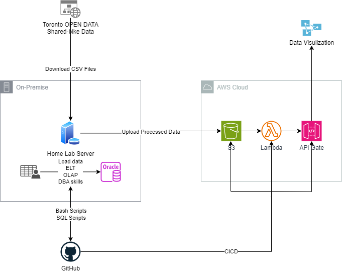

# DBA Project: Toronto Shared-Bike Ridership Analysis

A repo of a DBA project.

- ref:
  - https://github.com/simonangel-fong/R_Bike-Share_Ridership_Analysis

---

## Documentation

- Set up a local server

  - [Part1: Install `Oracle Linux`](./doc/local/ol_install/ol_install.md)

  - [Part2: Create `SSH` Connection](./doc/local/ssh/ssh.md)
  - Part: Install web server software - `Nginx`
  - Part: Install Oracle Database in the local server.

- Cloud
  - Alternative: Create an EC2 instance with Oracle Database

---

## Diagram

- [ ] Local Server
  - [x] OL8
  - [x] SSH
  - [ ] Oracle DB
- [ ] DBA
  - [ ] Listener + Descriptor + Connect SQL Developer
  - [ ] Create PDB
  - [ ] Create User
  - [ ] Create TB
  - [ ] Load CSV Data
- [ ] AWS
  - [ ] AWS CLI
  - [ ] Create S3 Bucket
  - [ ] Test: Upload CSV
  - [ ] CORN: Upload CSV
  - [ ] Create Lambda + API
- [ ] Data Visualization

---

[TOP](#dba-project-toronto-shared-bike-ridership-analysis)
