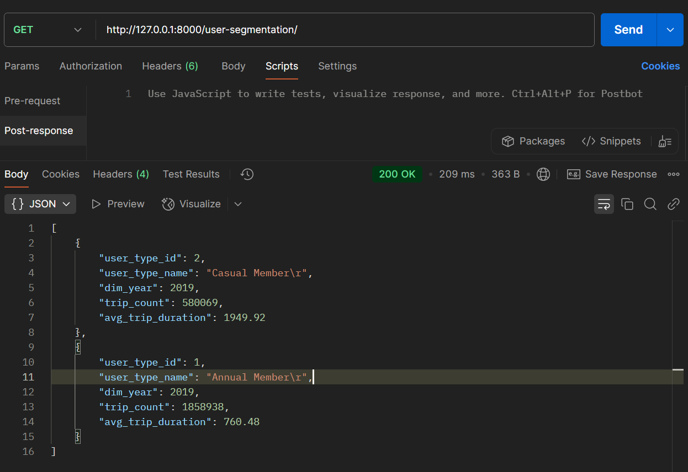

# Toronto Bike Share Data Warehouse Documentation - FastAPI: Local Oracle Connection

[Back](../../../README.md)

- [Toronto Bike Share Data Warehouse Documentation - FastAPI: Local Oracle Connection](#toronto-bike-share-data-warehouse-documentation---fastapi-local-oracle-connection)
  - [Prerequisites](#prerequisites)
  - [Install Packages](#install-packages)
  - [Centralizing Logging Configuration](#centralizing-logging-configuration)
  - [Centralizing Exception Configuration](#centralizing-exception-configuration)
  - [Configure Local Oracle Connection](#configure-local-oracle-connection)
    - [Define Environment File](#define-environment-file)
    - [Define Settings](#define-settings)
    - [Define Database Connection](#define-database-connection)
    - [Define Data Model](#define-data-model)
    - [Define Main](#define-main)
    - [Run Application](#run-application)
  - [Collect Package Info](#collect-package-info)

---

## Prerequisites

- Existing Oracle Database
  - Host: localhost
  - Service: pdb1
  - user: apiTester
  - pwd: apiTester1234
  - Data: MV created and refreshed

---

## Install Packages

```sh
pip install pydantic pydantic_settings oracledb sqlalchemy
```

---

## Centralizing Logging Configuration

- `Config/logging.py`

```py
import os
import logging
from typing import Optional


def setup_logging(log_level: str = "INFO", log_file: Optional[str] = None) -> None:
    """
    Configure application-wide logging.

    Args:
        log_level: Logging level (e.g., "INFO", "DEBUG"). Defaults to "INFO".
        log_file: Optional file path to log to in addition to console.
    """
    # Convert string level to logging constant
    level = getattr(logging, log_level.upper(), logging.INFO)

    # Define handlers
    handlers = [logging.StreamHandler()]  # Console output
    if log_file:
        handlers.append(logging.FileHandler(log_file))

    # Configure logging
    logging.basicConfig(
        level=level,
        format="%(asctime)s - %(name)s - %(levelname)s - %(message)s",
        handlers=handlers,
    )

    # Ensure this runs only once
    if not logging.getLogger(__name__).hasHandlers():
        logging.getLogger(__name__).info("Logging configured successfully.")


def configure_logging_from_env() -> None:
    log_level = os.getenv("LOG_LEVEL", "INFO")
    log_file = os.getenv("LOG_FILE", None)
    setup_logging(log_level=log_level, log_file=log_file)

```

---

## Centralizing Exception Configuration

- `Config/exception.py`

```py
class ApplicationError(Exception):
    """Base exception class for all custom application errors."""

    def __init__(self, message: str, status_code: int = 500):
        self.message = message
        self.status_code = status_code
        super().__init__(self.message)


class ConfigurationError(ApplicationError):
    """Raised when configuration loading fails."""

    def __init__(self, message: str):
        super().__init__(message=message, status_code=500)


class DatabaseError(ApplicationError):
    """Raised when database operations fail."""

    def __init__(self, message: str):
        super().__init__(message=message, status_code=503)

```

---

## Configure Local Oracle Connection

### Define Environment File

- `.env`

```conf
ORCLDB_HOST="localhost"
ORCLDB_SID="ORCLCDB"
ORCLDB_PORT="1521"
ORCLDB_SERVICE="toronto_shared_bike"
ORCLDB_USER="apiTester1"
ORCLDB_PWD="apiTester123"
```

---

### Define Settings

- `Config/settings.py`

```py
import logging
from functools import lru_cache
from pydantic_settings import BaseSettings, SettingsConfigDict
from .exceptions import ConfigurationError

# retrieve a logger object
logger = logging.getLogger(__name__)


class Settings(BaseSettings):
    """Database connection settings loaded from environment variables."""
    ORCLDB_HOST: str
    ORCLDB_SID: str
    ORCLDB_PORT: str
    ORCLDB_SERVICE: str
    ORCLDB_USER: str
    ORCLDB_PWD: str

    model_config = SettingsConfigDict(
        env_file=".env",
        extra="forbid"  # Prevent unexpected fields
    )


@lru_cache
def get_settings():
    """
    Load and cache application settings from environment variables.
    Returns:
        Settings: Configured settings object.
    Raises:
        ConfigurationError: If settings cannot be loaded due to missing or invalid values.
    """
    try:
        settings = Settings()
        logger.info("Settings loaded successfully.")
        return settings
    except Exception as e:  # Broad exception catch for simplicity; refine as needed
        logger.error(f"Failed to load settings: {str(e)}")
        raise ConfigurationError(f"Unable to load configuration: {str(e)}")

```

---

### Define Database Connection

- `Config/database.py`

```py
import logging
from typing import Generator
from sqlalchemy import create_engine
from sqlalchemy.orm import sessionmaker, Session
from sqlalchemy.exc import OperationalError

from .settings import get_settings
from .exceptions import DatabaseError,ConfigurationError

# Configure logging
logger = logging.getLogger(__name__)

def init_db() -> sessionmaker:
    """
    Initialize the database engine and session factory.

    Returns:
        sessionmaker: Configured SQLAlchemy session factory.

    Raises:
        ConfigurationError: If settings cannot be loaded.
        DatabaseError: If database engine cannot be created.
    """
    logger.info("Initializing database...")
    try:
        settings = get_settings()
        logger.info("Database settings loaded successfully.")
    except ConfigurationError as e:
        logger.error(f"Failed to load settings: {str(e)}")
        raise

    try:
        # Use keyword arguments to avoid embedding credentials in the URL
        engine = create_engine(
            "oracle+oracledb://",
            connect_args={
                "user": settings.ORCLDB_USER,
                "password": settings.ORCLDB_PWD,
                "host": settings.ORCLDB_HOST,
                "port": settings.ORCLDB_PORT,
                "service_name": settings.ORCLDB_SERVICE,
            },
            echo=False  # Set to True for debugging SQL queries
        )
        logger.info("Database engine created successfully.")
        return sessionmaker(autocommit=False, autoflush=False, bind=engine)
    except Exception as e:
        logger.error(f"Failed to create database engine: {str(e)}")
        raise DatabaseError(f"Database initialization failed: {str(e)}")


# Lazy initialization of SessionLocal
try:
    SessionLocal = init_db()
except (ConfigurationError, DatabaseError) as e:
    logger.critical(f"Application startup failed: {str(e)}")
    raise


def get_db() -> Generator[Session, None, None]:
    """
    Provide a database session for FastAPI dependency injection.

    Yields:
        Session: SQLAlchemy session object.

    Raises:
        DatabaseError: If session creation or usage fails.
    """
    db = SessionLocal()
    try:
        yield db
    except OperationalError as e:
        logger.error(f"Database operation failed: {str(e)}")
        raise DatabaseError(f"Database connection error: {str(e)}")
    finally:
        db.close()
        logger.debug("Database session closed.")
```

---

### Define Data Model

- `Models/MVUserSegmentation.py`

```py
from sqlalchemy import Column, Integer, String, Float
from sqlalchemy.ext.declarative import declarative_base
from pydantic import BaseModel

# SQLAlchemy Base
Base = declarative_base()


class MVUserSegmentation(Base):
    __tablename__ = "mv_user_segmentation"
    __table_args__ = {"schema": "dw_schema"}

    # Using as primary key with year
    user_type_id = Column(Integer, primary_key=True)
    user_type_name = Column(String)
    # Using as composite primary key with user_type_id
    dim_year = Column(Integer, primary_key=True)
    trip_count = Column(Integer)
    avg_trip_duration = Column(Float)


class UserSegmentationResponse(BaseModel):
    user_type_id: int
    user_type_name: str
    dim_year: int
    trip_count: int
    avg_trip_duration: float

    class Config:
        orm_mode = True  # Enables compatibility with SQLAlchemy ORM objects

```

---

### Define Main

```py
import logging
from typing import List
from fastapi import FastAPI, Depends, Query, HTTPException
from sqlalchemy.orm import Session
from sqlalchemy.exc import SQLAlchemyError

from .Config.logging import configure_logging_from_env
from .Config.database import get_db
from .Config.exceptions import DatabaseError
from .Models.MVUserSegmentation import MVUserSegmentation, UserSegmentationResponse

# Configure logging at startup
configure_logging_from_env()

app = FastAPI(title="User Segmentation API")

logger = logging.getLogger(__name__)

logger.info("Application starting up...")


@app.get(
    "/user-segmentation/",
    response_model=List[UserSegmentationResponse],
    tags=["User Segmentation"],
    summary="Retrieve user segmentation data",
)
def get_user_segmentation(
    db: Session = Depends(get_db),
    skip: int = Query(0, ge=0, description="Number of records to skip"),
    limit: int = Query(100, ge=1, le=1000,
                       description="Maximum number of records to return"),
) -> List[UserSegmentationResponse]:
    """
    Fetch user segmentation data from the materialized view.

    Args:
        db: SQLAlchemy session provided by dependency injection.
        skip: Number of records to skip for pagination (default: 0).
        limit: Maximum number of records to return (default: 100, max: 1000).

    Returns:
        List of user segmentation records.

    Raises:
        HTTPException: If a database error occurs (status code 503).
    """
    logger.info(
        f"Fetching user segmentation data with skip={skip}, limit={limit}")
    try:
        query = db.query(MVUserSegmentation)
        result = query.offset(skip).limit(limit).all()
        logger.debug(
            f"Retrieved {len(result)} records from MV_USER_SEGMENTATION")
        return result
    # if db error
    except (SQLAlchemyError, DatabaseError) as e:
        logger.error(f"Database error in get_user_segmentation: {str(e)}")
        raise HTTPException(
            status_code=503,
            detail="Service unavailable due to a database error. Please try again later."
        )
    # if other error
    except Exception as e:
        logger.error(f"Unexpected error in get_user_segmentation: {str(e)}")
        raise HTTPException(
            status_code=500,
            detail="An unexpected error occurred."
        )

```

---

### Run Application

```sh
uvicorn app.main:app --port 8000
```



---

## Collect Package Info

```sh
pip freeze > requirements.txt
```

---

```sh
docker commit database-container simonangelfong/toronto-shared-bike-db-prebuilt:year2019
docker push simonangelfong/toronto-shared-bike-db-prebuilt:year2019

docker commit fastapi-container simonangelfong/toronto-shared-bike-fastapi-prebuilt:v1.0
docker push simonangelfong/toronto-shared-bike-fastapi-prebuilt:v1.0
```