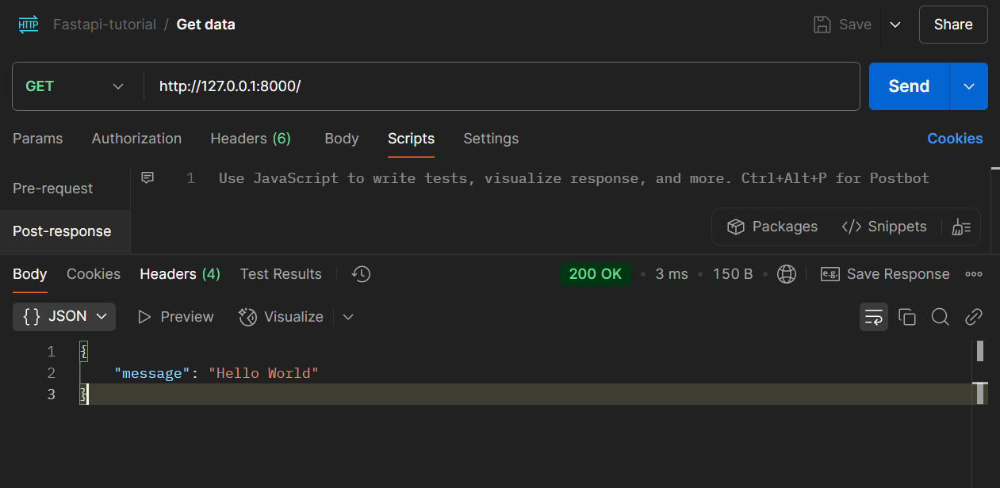

# Toronto Bike Share Data Warehouse Documentation - FastAPI: Environment Setup

[Back](../../../README.md)

- [Toronto Bike Share Data Warehouse Documentation - FastAPI: Environment Setup](#toronto-bike-share-data-warehouse-documentation---fastapi-environment-setup)
  - [Setup Virtual Environment](#setup-virtual-environment)
  - [First Route](#first-route)
  - [Collect Package Info](#collect-package-info)

---

## Setup Virtual Environment

```sh
python -m venv env

# select interpreter
python -m pip install --upgrade pip
pip install "fastapi[standard]"
pip install "uvicorn[standard]"
```

---

## First Route

- `app/main.py`

```py
from fastapi import FastAPI

app = FastAPI()


@app.get("/")
async def root():
    return {"message": "Hello World"}
```

- Run

```sh
fastapi dev app/main.py

uvicorn app.main:app
uvicorn app.main:app --reload --port 8000
```



---

## Collect Package Info

```sh
pip freeze > requirements.txt
```