# Transform an old laptop into a home lab server - Part 1

[Back](../../../README.md)

- [Transform an old laptop into a home lab server - Part 1](#transform-an-old-laptop-into-a-home-lab-server---part-1)
  - [Introduction](#introduction)
  - [Hardware Specifications](#hardware-specifications)
  - [Software Requirements](#software-requirements)
  - [OS Installation Steps](#os-installation-steps)
    - [Overview](#overview)
    - [Prepare Bootstrapping USB](#prepare-bootstrapping-usb)
    - [Install Linux](#install-linux)
      - [Keyboard Layout](#keyboard-layout)
      - [Installation Source](#installation-source)
      - [Installation Destination](#installation-destination)
      - [Software Selection](#software-selection)
      - [KDUMP](#kdump)
      - [Time \& Date](#time--date)
      - [Networking \& Host Name](#networking--host-name)
      - [Security Policy](#security-policy)
      - [Root Password](#root-password)
      - [Create User](#create-user)
    - [Login after installation](#login-after-installation)
  - [Summary](#summary)

---

## Introduction

- Purposes:

  - **Transforming an Old Laptop:**
    - Discover how to repurpose an **aging laptop**, turning it into a local server.
    - This cost-effective solution allows to breathe new life into hardware that might otherwise go unused.
  - **Hands-on Learning with Linux:**
    - Dive into the world of Linux as walking through the step-by-step process of setting up and configuring the operating system.
    - This guide is an excellent opportunity to learn and practice essential skills in Linux administration.
  - **Building a Foundation for Database Projects:**
    - Lay the groundwork for a database project by establishing a robust server environment.

- Part 1:
  - Intall `Oracle Linux 8`

---

## Hardware Specifications

- Computer specifications

  - Band: `Dell`
  - Year: 2015
  - CPU: `intel-i5`
  - Ram: `8Gb`
  - Disk: `500Gb`

- My **"High performance"** old laptop.
  - Poor guy (>,<)!

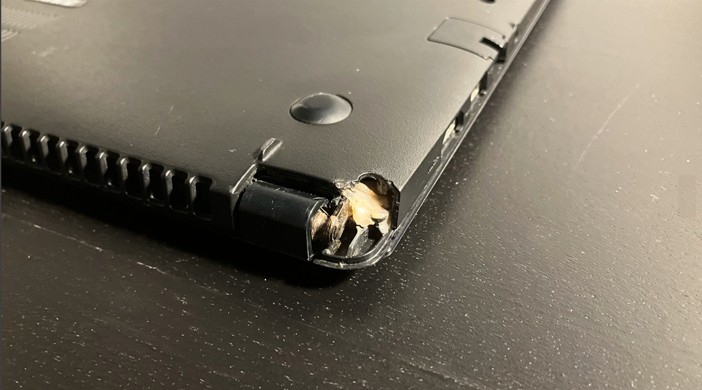

- In the following document, I refer to this old laptop as the `home lab server`.

---

## Software Requirements

- Choose of OS:
  - `Oracle Linux 8.8`
- Reason:
  - The installation is the first step of a database project. The OL8 works well with the Oracle Database.
  - ref: https://www.oracle.com/database/technologies/databaseappdev-vm.html
- ISO source:
  - https://yum.oracle.com/oracle-linux-isos.html

---

## OS Installation Steps

### Overview

- Migrate sensitive information from the `home lab server`
- Format disk
- Download `Oracle Linux 8.8`
- Burn bootstrapping USB
- Install OL8.8 on the `home lab server`

---

### Prepare Bootstrapping USB

- Burn bootstrapping USB:
  - `balenaEtcher`: https://etcher.balena.io/

---

### Install Linux

- Old laptop and bootstrapping USB

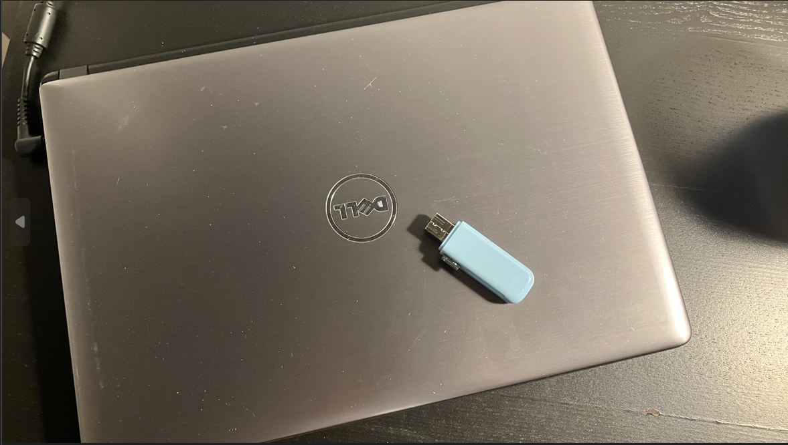

- Select boot device

- Boot from USB

- Enter OL8 **Welcome Screen**

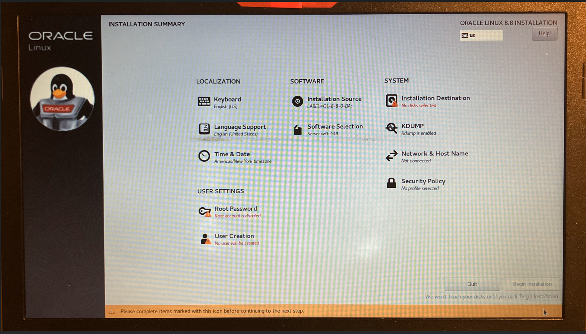

---

#### Keyboard Layout

- Select English

---

#### Installation Source

- Select the source in the USB

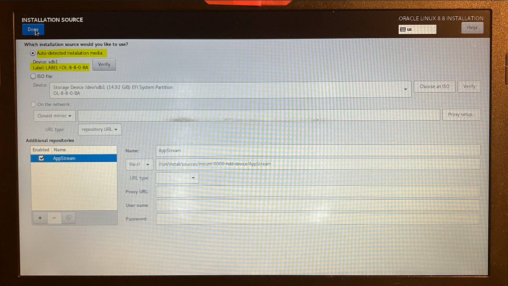

---

#### Installation Destination

- Select device

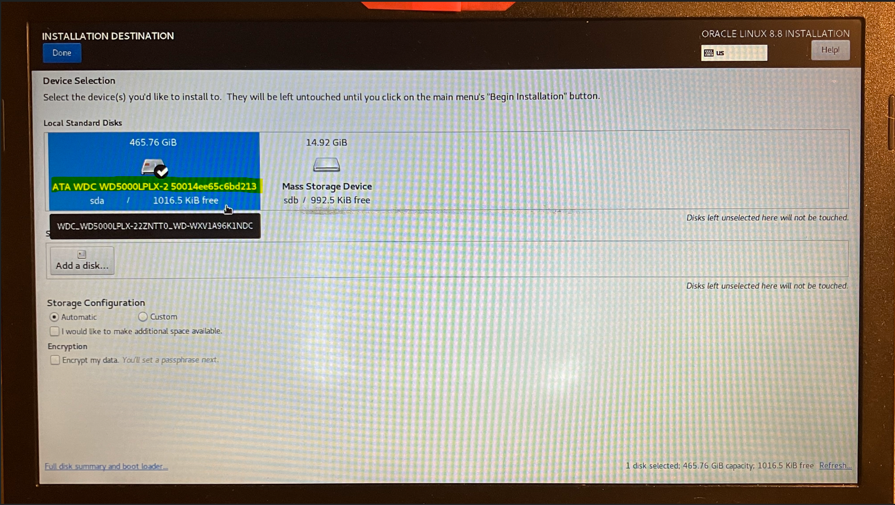

- Reclaim disk space might be required

---

#### Software Selection

- Select development tools

---

#### KDUMP

- Use default configurations.

---

#### Time & Date

- Select region

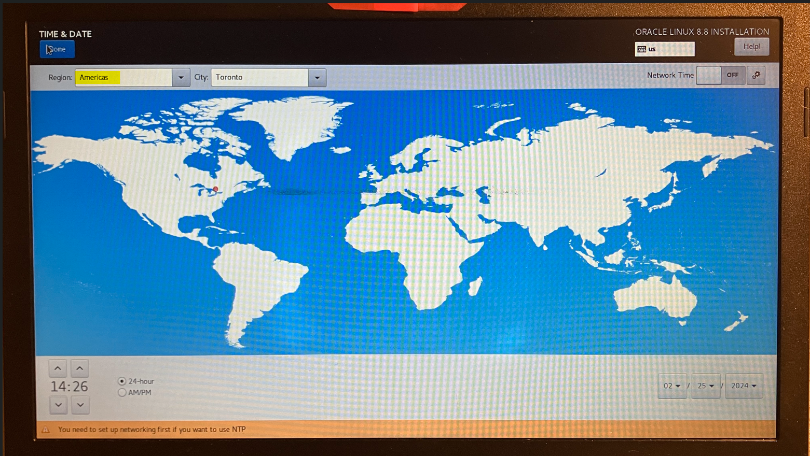

---

#### Networking & Host Name

- Select Wireless Connection
- Configure Host Name

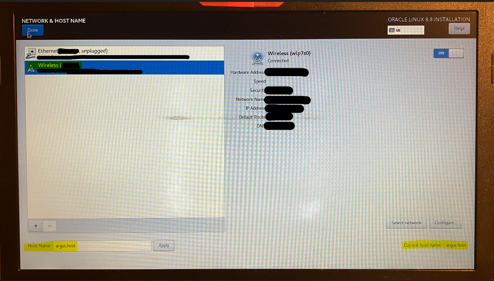

---

#### Security Policy

- Unable "Apply security policy"

---

#### Root Password

- root passsword

---

#### Create User

- Username and password

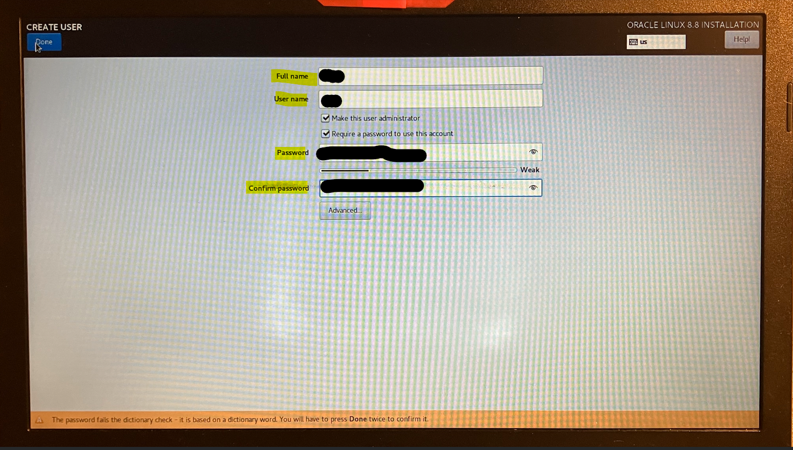

---

- When completing all configurations, it will start the installation.

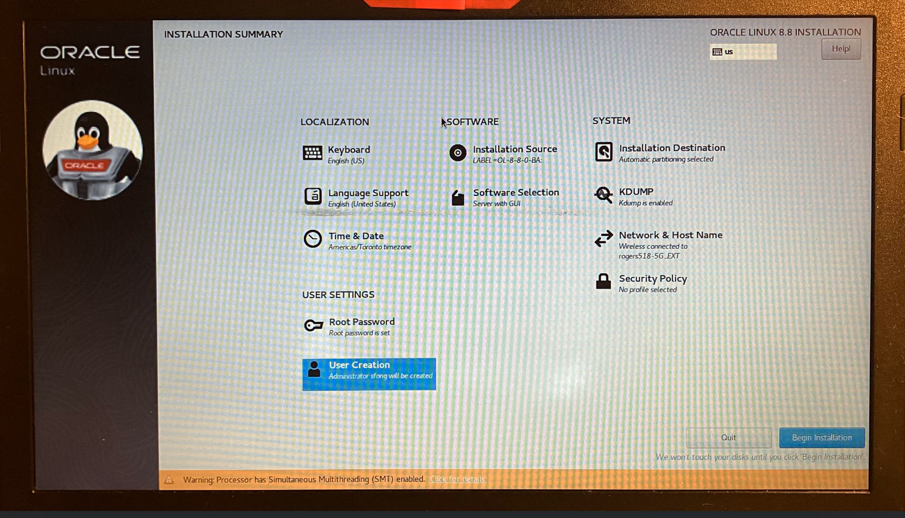

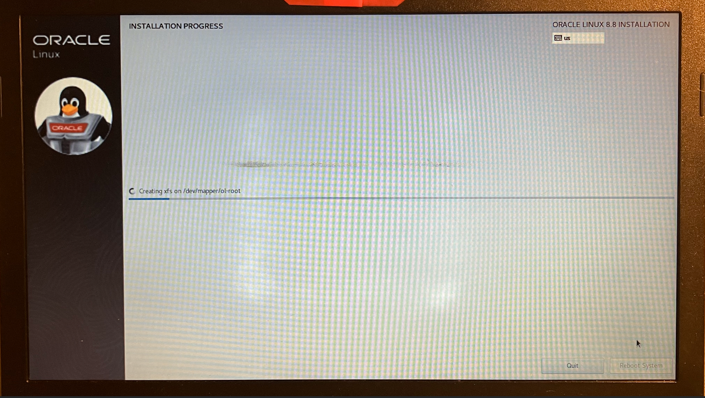

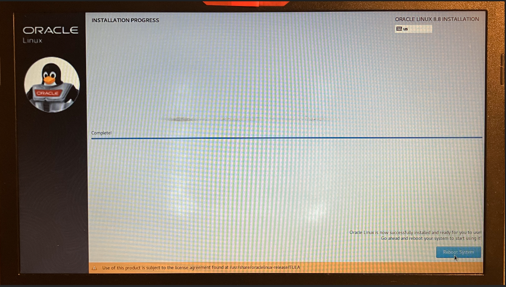

---

### Login after installation

- Accept license

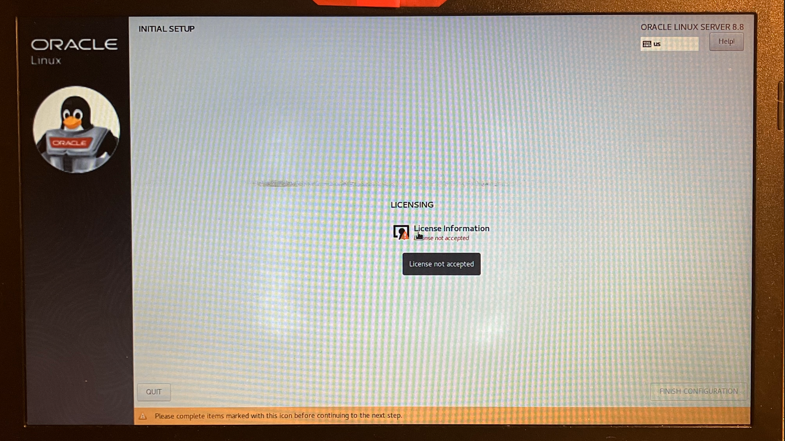

- Login

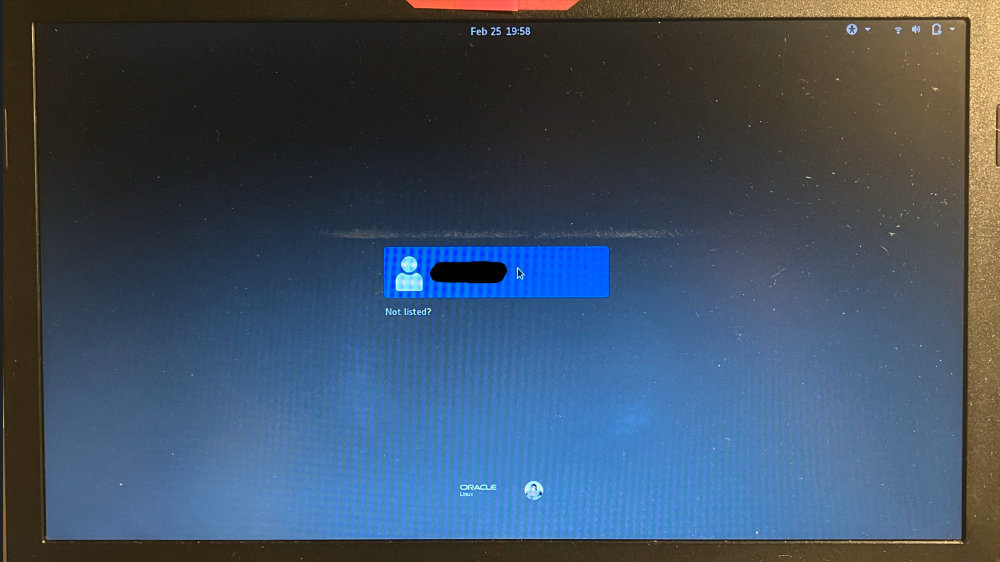

- Uncheck the **Location Services**

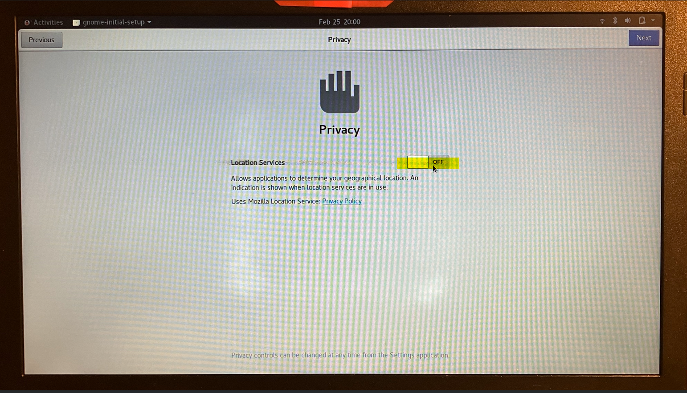

- Update packages

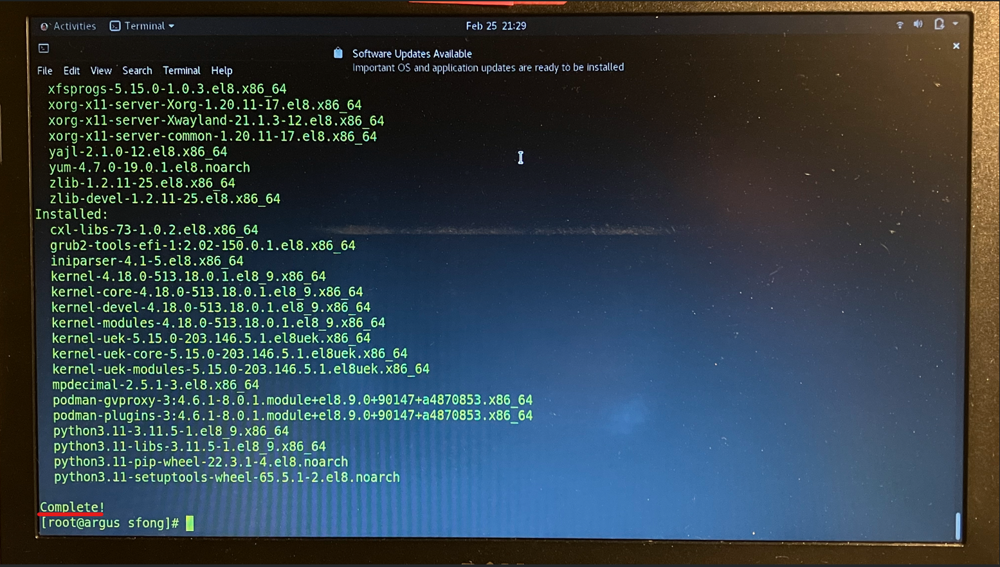

- OS information

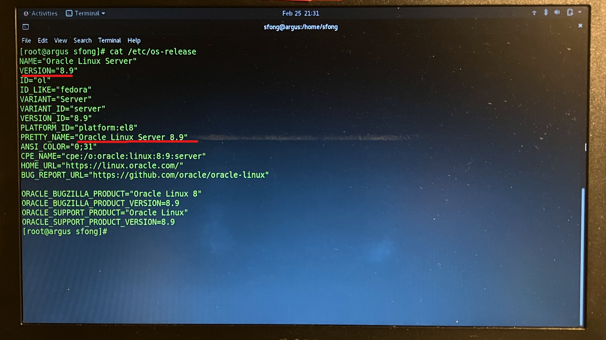

---

## Summary

- This is a brief document on how to install `Oracle Linux OS`
- Installation Steps:
  - Prepare Bootstrapping USB
  - Install Linux:
    - Keyboard Layout
    - Installation Source
    - Installation Destination
    - Software Selection
    - KDUMP
    - Time & Date
    - Networking & Host Name
    - Security Policy
    - User Account
- It is an interesting exploration to have hands-on experience regarding Linux OS.

---

[TOP](#transform-an-old-laptop-into-a-home-lab-server---part-1)
